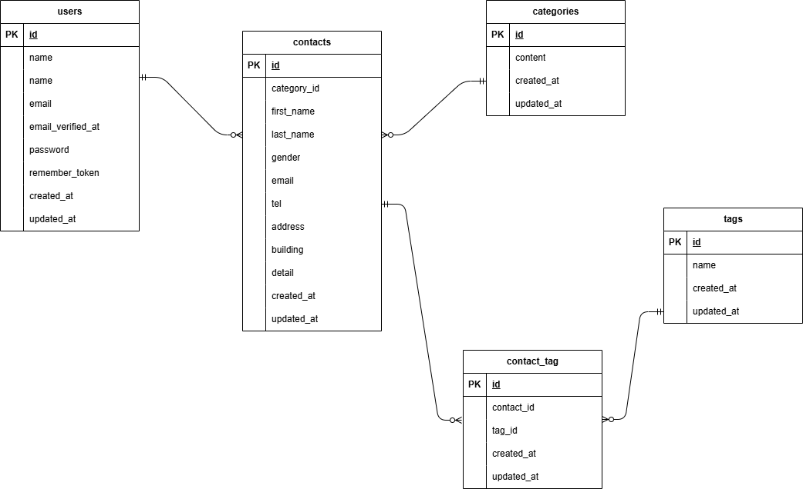

## プロジェクト名
「COACHTECH お問い合わせフォーム」
## 概要
```
プロジェクトの目的：COACHTECH お問い合わせフォームを開発する。
システム概要：本システムは、一般ユーザーが利用する公開のお問い合わせフォームです。
　　　　　　　誰でもお問い合わせを送信でき、管理者はログイン後にその内容を確認・管理します。
```
## ER図

## 環境構築手順
1. リポジトリをクローン

```
git clone git@github.com:Takeru-Hirayama/contact-form-app.git
```

2. .envファイルの準備

```
cp .env.example .env
```

```
DB_CONNECTION=mysql
DB_HOST=mysql
DB_PORT=3306
DB_DATABASE=laravel
DB_USERNAME=sail
DB_PASSWORD=password
```

3. パッケージのインストール

```
docker run --rm \
-u "$(id -u):$(id -g)" \
-v "$(pwd):/var/www/html" \
-w /var/www/html \
laravelsail/php82-composer:latest \
composer install --ignore-platform-reqs
```

4. Laravel Sailの起動

```
./vendor/bin/sail up -d
```

5. アプリケーションキーの作成

```
sail artisan key:generate
```

6. データベースのマイグレーションとシーディング

```
sail artisan migrate:fresh --seed
```

7. フロントエンドのビルド

```
sail npm install
sail npm install alpinejs
sail npm run dev
```
## 使用技術
```
OS（Dockerが動作する任意のOS）: Windows
PHP : 8.2
Laravel : 10.x
DB : MySQL 8.0
Webサーバー : Nginx
フロントエンド : Vite, Tailwind CSS ^3.4.0
開発ツール : Docker, Laravel Sail, phpMyAdmin
```
## APIエンドポイント一覧
```
HTTPメソッド	　　　URI	　　　　　　　　　　　　　説明	　　　　　　　　　　　　　　　　　認証
GET	　　　　　/api/v1/contacts	　　　　　お問い合わせ一覧（検索・ページネーション付き）	不要
GET　　　/api/v1/contacts/{contact}	　　　　　お問い合わせ詳細（カテゴリ・タグ含む）	　　不要
POST	　　　/api/v1/contacts	　　　　　　　お問い合わせ新規作成	　　　　　　　　　　　　不要
PUT	　　　　/api/v1/contacts/{contact}	　　　お問い合わせ更新	　　　　　　　　　　　　　　不要
DELETE	　　/api/v1/contacts/{contact}	　　　お問い合わせ削除	　　　　　　　　　　　　　　不要
```
## 開発環境URL
```
一般ユーザ向け：http://localhost/
管理者向け：http://localhost/admin
phpMyAdmin：http://localhost:8080/
```
## 作成者
```
平山健
```git